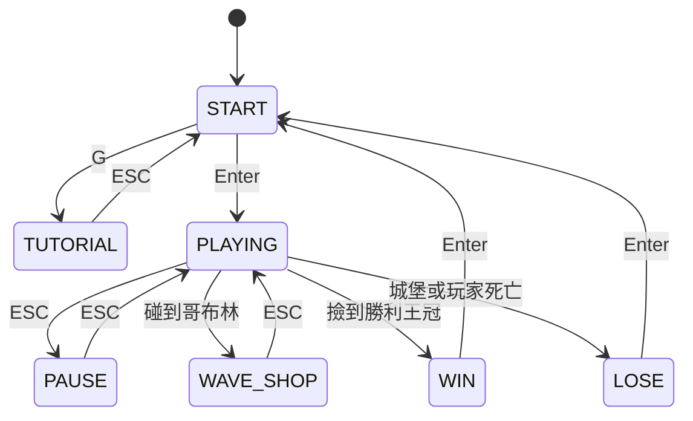

# Tower Defense Game

使用 C++ 和 raylib 製作的 2D 塔防射擊遊戲。本文件說明遊戲規則、程式如何運作、各類別職責、狀態機流程與傷害計算邏輯。

---

## 一、基礎遊戲規則

- 畫面左邊是**城堡**，右邊會一波波生出**敵人**往左走。
- 玩家在中間，可左右移動、跳躍、朝滑鼠游標射擊（射擊有冷卻）。
- 敵人走到城堡或玩家身上會造成傷害並消失；**城堡或玩家血量歸零就輸**。
- 擊殺敵人掉**金幣**，金幣用來在商店升級能力、買武器和藥水。
- 撐過所有波次後，天空會落下**勝利王冠**，玩家走過去撿到才正式獲勝。
- 每 3 波會出現一隻**哥布林商人**，碰到它進入波次商店。

### 操作方式

| 按鍵 | 功能 |
|------|------|
| A / D | 左右移動 |
| W | 跳躍 |
| 滑鼠左鍵 | 射擊 |
| ESC | 暫停 / 升級商店 |
| 1~9 | 購買升級 / 商店物品 |
| Enter | 開始 / 繼續 |
| G | 教學 |
| H | Debug 碰撞箱（顯示綠色 AABB 框線） |
| F | 回饋表單 |

---

## 二、遊戲狀態機（game_statement）

整個遊戲由一個有限狀態機控制，主迴圈 `run()` 每幀依照當前狀態呼叫對應的 `handle_*()` 函式。



| 狀態 | 說明 |
|------|------|
| `START` | 開始畫面 |
| `TUTORIAL` | 教學頁面 |
| `PLAYING` | 主遊戲（只有這個狀態會跑 `update()`） |
| `PAUSE` | 暫停＝升級商店（花金幣升級 9 種能力） |
| `WAVE_SHOP` | 哥布林商店（買 2 武器 + 1 藥水） |
| `WIN` / `LOSE` | 結算畫面，按 Enter 重置回 START |

關鍵點：只有 `PLAYING` 狀態下的 `handle_playing()` 會呼叫 `update()` 與 `draw()`，其他狀態只畫自己的畫面。

---

## 三、程式邏輯處理（update 的七個階段）

每一幀 `game::update(dt)` 都照固定順序跑完七個階段，這是整個遊戲的核心流程：

1. **輸入** — 按住滑鼠左鍵且冷卻好就建立子彈（含多重射擊的扇形散射）。
2. **生成** — 波次管理：計時生出敵人、波次結束換下一波、每 3 波開商店、最終波後生成勝利王冠。
3. **狀態更新** — 先把所有敵人速度重置，再跑光環 buff／治療效果，更新傷害飄字，最後呼叫所有物件的 `update()`。
4. **碰撞** — 子彈打敵人、敵人撞城堡、敵人撞玩家、玩家撿金幣、哥布林互動、玩家撿禮物。
5. **效果** — 玩家回血、敵人死亡掉金幣、毒傷每秒結算。
6. **清理** — 刪掉過期金幣與飛出畫面的子彈。
7. **遊戲判定** — 城堡或玩家死亡就切到 `LOSE`。

---

## 四、傷害算法

### 玩家子彈打敵人

子彈命中敵人時，傷害依序這樣算：

1. **基礎傷害** = 子彈傷害。
2. **減傷**：附近若有敵人帶光環（藍色史萊姆），傷害乘上減傷倍率（`damage_reduction`）。
3. **暴擊**：
   - 暴擊率 = 子彈暴擊率 + 玩家暴擊率 + 暴擊藥水加成
   - 暴擊倍率 = 子彈暴擊倍率 + 玩家暴擊倍率（+ 暴擊藥水額外加成）
   - 擲骰命中暴擊時：`傷害 ×= 暴擊倍率`，再加上 `敵人當前血量 × crit_hp_percent`（鐵球的斬殺機制）。
4. **攻擊藥水**：`傷害 ×= 攻擊 buff 倍率`。
5. **結算**：對敵人 `take_damage(傷害)`，並飄出傷害數字。
6. **範圍傷害**：火球／飛彈會對 `splash_range` 內的其他敵人造成 `傷害 × splash_damage`。
7. **附加效果**：依武器套用緩速 / 冰凍 / 疊毒。
8. **穿透**：穿透箭命中後位移略過敵人繼續飛，否則子彈刪除。

### 敵人撞城堡 / 玩家

- 傷害 = 敵人當前血量（撞上去等於自爆）。
- 附近有光環敵人時，傷害乘上增傷倍率（`damage_boost`）。
- 最後乘上護盾倍率：`take_damage(傷害 × 護盾值)`。

### 毒傷

中毒的敵人每隔一段時間結算一次：`毒傷 = 單層毒傷 × 毒疊層數`，結算後層數遞減一層。

### 異常狀態（update_status）

敵人每幀更新三種狀態：**緩速**（速度打折）、**冰凍**（速度歸零＝停住）、**中毒**（計時到就標記可結算）。冰凍透過把緩速倍率設為 0 來讓敵人停下，但光環、治療等行為仍會運作。

---

## 五、類別總覽（每個類別在幹嘛）

### 核心基底

| 類別 | 職責 |
|------|------|
| `game_object` | 所有遊戲物件的抽象基底，管位置、大小、純虛擬 `update()` |
| `health` | 血量元件（hp / max_hp），被別的類別組合使用 |
| `character` | `game_object` + `health` + 速度，角色基底，提供基礎速度與 `reset_speed()` |
| `building` | `game_object` + `health`，建築基底 |

### 角色與敵人

| 類別 | 職責 |
|------|------|
| `player` | 玩家：鍵盤移動、跳躍、重力、攻擊冷卻、邊界限制 |
| `enemy` | 敵人基底：狀態（緩速/冰凍/中毒）+ 行為清單，提供「地面移動」的預設 `update()` |
| `land_enemy` | 地面敵人，直接沿用 `enemy` 的預設移動 |
| `sky_enemy` | 飛行敵人，覆寫 `update()` 加上 sin 波動的上下飄移 |
| `goblin` | 商店 NPC，沿用 `enemy` 的移動，可被冰凍/緩速/中毒 |
| `castle` | 城堡，固定不動，被打爆就遊戲結束 |

### 物件

| 類別 | 職責 |
|------|------|
| `projectile` | 子彈，攜帶武器特效數值（穿透/緩速/冰凍/毒/爆炸/暴擊） |
| `falling_object` | 有重力的掉落物基底，預設 `update()` 直接套用重力物理 |
| `coin` | 金幣，掉落彈跳 + 計時自動消失 |
| `crown` | 勝利王冠 |
| `special_gift` | 隱藏彩蛋禮物盒 |

### 行為（策略模式）

| 類別 | 職責 |
|------|------|
| `enemy_behavior` | 行為抽象介面，並提供 buff/heal 的查詢函式 |
| `jump_behavior` | 小跳 / 大跳交替 |
| `buff_behavior` | 光環：對周圍敵人加速、增傷、減傷 |
| `heal_behavior` | 範圍治療：定時幫周圍敵人回血 |
| `fall_and_float_behavior` | 旋風怪：從天而降後懸浮飄動 |

### 支援系統

| 類別 | 職責 |
|------|------|
| `wave` / `wave_data` | 一波要出哪些敵人、間隔多久 |
| `damage_text` | 傷害數字飄字效果 |
| `game_factory` | 靜態工廠，統一建立所有物件，集中存放所有數值常數 |
| `game` | 主控：狀態機 + 持有所有物件 + 主迴圈 + 碰撞/渲染 |

程式碼依職責拆成三個檔：`Game.cpp`（生命週期與各 `handle_*`）、`GameUpdate.cpp`（`update()` 邏輯）、`DrawUI.cpp`（`draw()` 渲染）。

---

## 六、敵人一覽（10 種）

| 名稱 | 代號 | 血量 | 速度 | 特色 |
|------|------|------|------|------|
| 綠色史萊姆 | **LGN** | 70 | 快 | 陸地移動 + 小跳 |
| 黑色史萊姆 | **LBK** | 500 | 慢 | 高血量坦克 |
| 紅色史萊姆 | **LRD** | 40 | 極快 | 陸地移動 + 小跳 |
| 紫色史萊姆 | **LPE** | 200 | 中 | 小跳與大跳交替 |
| 藍色史萊姆 | **LBE** | 150 | 中 | 增傷/加速/減傷光環 |
| 天使 | **SAL** | 170 | 中 | 天空飛行 + 範圍治療 |
| 小鳥 | **SBD** | 40 | 快 | 天空飛行 + 快速移動 |
| 飛龍 | **SDN** | 1500 | 慢 | Boss 級天空飛行 |
| 旋風怪 | **SWD** | 500 | 靜止 | 空中生成急速下墜後地面漂浮 |
| 哥布林 | — | 500 | 中 | 每 3 波出現，碰城堡補血，玩家碰觸進商店 |

## 七、武器一覽（11 種）

| 武器 | 費用 | 傷害倍率 | 攻速倍率 | 特殊效果 |
|------|------|----------|----------|----------|
| 泥巴球 | 免費 | 1.0x | 1.0x | 基礎武器，10% 緩速 |
| 弓箭 | 150 | 1.4x | 0.6x（快） | 高攻速投射物 |
| 石箭 | 150 | 1.7x | 1.0x | 高傷害箭矢 |
| 冰緩箭 | 100 | 1.4x | 0.6x | 50% 緩速 |
| 毒箭 | 100 | 0.8x | 0.8x | 20% 緩速 + 1.2x 疊加毒傷 |
| 穿透箭 | 150 | 1.3x | 1.3x | 穿透路徑上所有敵人 |
| 鐵球 | 100 | 2.5x | 1.0x | 1% 暴擊率，暴擊扣 80% 當前血量 |
| 火球 | 150 | 1.8x | 1.0x | 範圍爆炸（半徑 140，0.4x 波及） |
| 火箭 | 100 | 1.7x | 1.0x | 10% 機率 5 倍暴擊 |
| 冰凍箭 | 100 | 1.7x | 1.0x | 30% 緩速 + 冰凍 0.2 秒 |
| 飛彈 | 150 | 3.0x | 5.0x（慢） | 超大範圍爆炸（半徑 200，1.0x 波及）+ 10% 5 倍暴擊 |

## 八、藥水一覽（8 種）

| 藥水 | 費用 | 效果 |
|------|------|------|
| 治療玩家 | 30 | 回滿玩家血量 |
| 治療城堡 | 30 | 回滿城堡血量 |
| 攻擊強化 | 30 | 傷害倍率提升 |
| 攻速強化 | 30 | 攻擊速度提升 |
| 護盾 | 30 | 減少受到傷害 |
| 移速強化 | 20 | 移動速度提升 |
| 再生 | 30 | 持續回復血量 |
| 暴擊提升 | 50 | 提升暴擊傷害與機率 |

## 九、升級商店（ESC 開啟，9 種）

| 按鍵 | 項目 | 基礎費用 | 成長費用 | 效果 |
|------|------|---------|---------|------|
| 1 | 攻擊力 +5 | 20 | 10 | 玩家基礎傷害 +5 |
| 2 | 玩家血量 +100 | 20 | 10 | 玩家最大生命 +100 |
| 3 | 城堡血量 +100 | 20 | 10 | 城堡最大生命 +100 |
| 4 | 金幣上限 +100 | 50 | 50 | 攜帶金幣上限 +100 |
| 5 | 攻擊速度 | 50 | 30 | 提高武器攻速 |
| 6 | 多重射擊 +1 | 150 | 150 | 子彈數 +1（扇形散射） |
| 7 | 移動速度 | 50 | 50 | 提高左右移動速度 |
| 8 | 暴擊率 +2% | 30 | 50 | 暴擊機率 +2% |
| 9 | 暴擊傷害 +25% | 30 | 50 | 暴擊倍率 +25% |

每項可多次升級，費用隨等級遞增。

---

## 十、波次系統與配置

關卡資訊從 `resources/levels.txt` 讀取，可用 `resources/level_editor.html` 視覺化編輯。

語法：`cooldown 怪物代號*數量`（例如 `0.6 SBD*10` = 間隔 0.6 秒生成 10 隻小鳥）。

代號對照：
- 陸地怪：`LGN`(綠) `LBK`(黑) `LRD`(紅) `LBE`(藍) `LPE`(紫)
- 天空怪：`SAL`(天使) `SBD`(小鳥) `SDN`(飛龍) `SWD`(風)

---

## 編譯與執行

```console
cmake -B build
cmake --build build
./build/TowerDefenseGame
```

## 聲明

- 圖片素材：PixelLab AI / Lovart AI 生成
- 背景音樂：[OtoLogic GB-Shooter Series](https://otologic.jp/free/bgm/game-shooter-gb01.html)（免費授權）
- 音效：Pixabay（免費授權）
