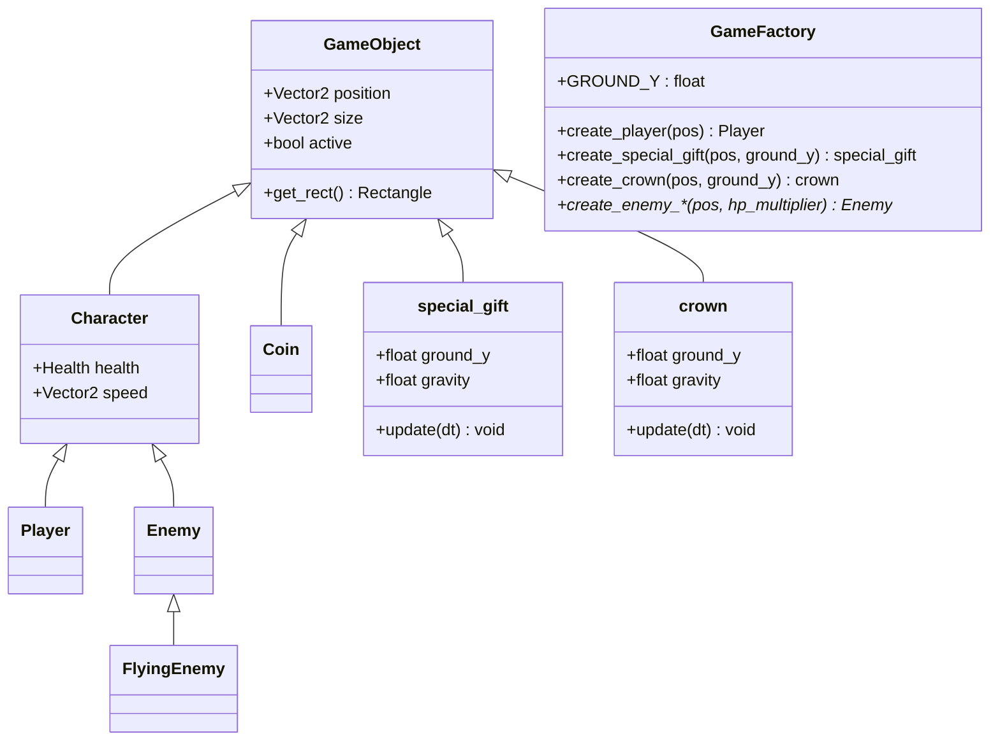

# Tower Defense Game - 核心架構設計與神秘彩蛋系統記憶

本文件記錄了專案在 OOP 教學框架下，新增的**三大核心拓展機制**（神秘禮物盒彩蛋、關卡勝利皇冠、動態金幣回饋）以及**圖片極致貼邊裁切技術**，以作為永久的架構記憶，方便後續繼承開發與報告展示。

---

## 1. 新增核心擴展機制 (Advanced Systems)

### 1.1 新手教學神秘禮物盒 Easter Egg 系統 (Mystery Gift Box)
*   **觸發源起 (Trigger)**：玩家在新手教學（`TUTORIAL` 狀態）畫面中，按 `Enter` 鍵累計超過 **50 次**，會觸發解鎖標記 `_is_gift_active = true`。
*   **物理下落 (Physics)**：當玩家回到主選單並開戰（`PLAYING` 狀態）時，系統會調用 `game_factory::create_special_gift` 於天空中 `{1500, -100}` 生成一個禮物盒 `_special_gift`，並以重力（$800\text{ px/s}^2$）物理模擬下落，精準著陸於地表。
*   **領取判定 (Collision)**：基於 Raylib 的 `CheckCollisionRecs` AABB 碰撞箱偵測。當玩家角色碰觸到禮物盒時，立刻銷毀物件並釋放記憶體，同時觸發無敵獎勵：
    *   **金幣與上限**：直接拉滿至 **`9999`**
    *   **玩家生命與上限**：利用 `increase_max_hp` 對齊並補血至 **`9999`**
    *   **城堡生命與上限**：同樣提升並回滿至 **`9999`**
    *   **玩家攻擊力**：永久暴增 **`+200.0f`**

### 1.2 勝利皇冠下落機制 (Victory Crown Drop)
*   **觸發源起**：當玩家撐過最後一波（全部波次結束且畫面上沒有任何敵人）時，勝利王冠會從空中降落。
*   **關卡結束判定**：皇冠落地後，玩家必須親自走過去碰撞拾取皇冠，才會正式觸發遊戲勝利的 `WIN` 狀態，大大提升了玩家達成勝利時的實體參與感與儀式感。

### 1.3 動態金幣回饋系統 (Dynamic Gold Reward Multiplier)
*   **設計理念**：為了解決後期怪獸強度大幅提升，但固定金幣收益帶來的成就感衰退問題，引入了與波次難度掛鉤的金幣倍增機制。
*   **技術實作**：在 `GameFactory.h` 建立所有敵人（地面、飛行、Boss）時，金幣掉落區間（`v.reward.x` 至 `v.reward.y`）會同步乘以該波次的生命強度倍率 `hp_multiplier`，實現動態收益回饋：
    $$\text{Gold\_Earned} = \text{GetRandomValue}(\text{min\_reward} \times \text{hp\_multiplier}, \text{max\_reward} \times \text{hp\_multiplier})$$

---

## 2. 圖片極致貼邊裁切技術 (Sprite Trimming)

為了實現高水準的 2D 物理碰撞與貼地表現，專案中使用了 Python 深度裁剪演算法，去除所有原始圖片周邊多餘的透明像素（Alpha 通道 $\le 10$），保證碰撞體和視覺邊緣完美重合。

| 素材物件 | 原始尺寸 (px) | 精剪後尺寸 (px) | 渲染比例 | 精確碰撞箱 (Hitbox) |
| :--- | :---: | :---: | :---: | :---: |
| **王冠 (`crown.png`)** | $1920 \times 1920$ | $1254 \times 975$ | `0.07f` | `{88, 68}` |
| **神秘禮物盒 (`gift.png`)** | $495 \times 504$ | $354 \times 354$ | `0.30f` | `{106, 106}` |

### 2.1 物理對齊推導（以禮物盒為例）：
*   地平線常數 `game_factory::GROUND_Y` = **`765`**。
*   在 `Game.cpp` 中以 `GROUND_Y - 106 = 659` 作為禮物盒的落地目標 Y 座標。
*   當禮物盒的物理 Y 座標因重力下落到達 `659` 時判定落地；渲染時，以 Y 軸 `659` 往下繪製 `106` 像素高度（`354 * 0.3`），盒子的底邊剛好貼在 `765`，與草地達到**完美像素級對齊**！

---

## 3. OOP 概念架構圖 (UML Topology)

