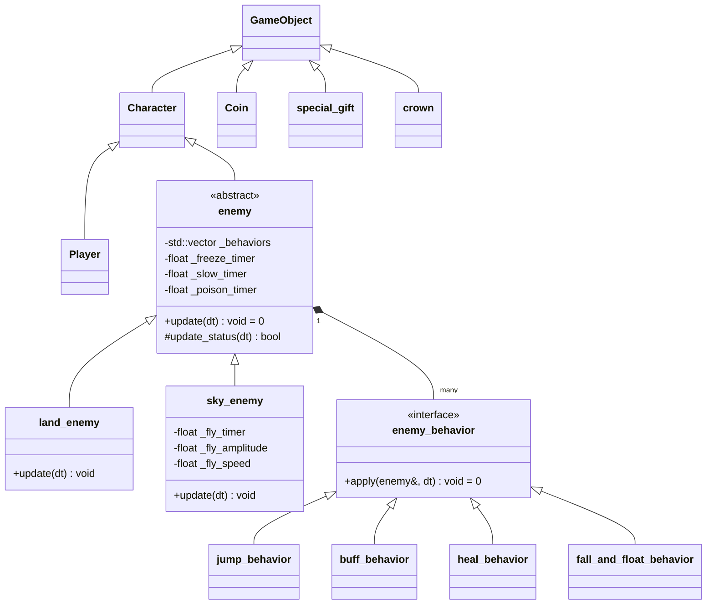

# Tower Defense Game - 核心架構設計與神秘彩蛋系統記憶

本文件記錄了專案在 OOP 教學框架下，新增的**三大核心拓展機制**、**二部曲核心 OOP 重構架構（平行對稱繼承、策略模式、無環依賴）**、**圖片極致貼邊裁切技術**，以及**武器與升級數值平衡系統**，以作為永久的架構記憶，方便後續繼承開發與報告展示。

---

## 1. 新增核心擴展機制 (Advanced Systems)

### 1.1 新手教學神秘禮物盒 Easter Egg 系統 (Mystery Gift Box)
*   **觸發源起 (Trigger)**：玩家在新手教學（`TUTORIAL` 狀態）畫面中，按 `Enter` 鍵累計超過 **50 次**，會觸發解鎖標記 `_is_gift_active = true`。
*   **物理下落 (Physics)**：當玩家回到主選單並開戰（`PLAYING` 狀態）時，系統會調用 `game_factory::create_special_gift` 於天空中 `{1500, -100}` 生成一個禮物盒 `_special_gift`，並以重力（$800\text{ px/s}^2$）物理模擬下落，精準著陸於地表。
*   **領取判定 (Collision)**：基於 Raylib 的 `CheckCollisionRecs` AABB 碰撞箱偵測。當玩家角色碰觸到禮物盒時，立刻銷毀物件並釋放記憶體，同時觸發無敵獎勵：
    *   **金幣與上限**：直接拉滿至 **`9999`**
    *   **玩家生命與上限**：利用 `increase_max_hp` 對齊並補血至 **`9999`**
    *   **城堡生命與上限**：同樣提升並回滿至 **`9999`**
    *   **玩家攻擊力**：永久暴增 **`+200.0f`**

### 1.2 勝利皇冠下落機制 (Victory Crown Drop)
*   **觸發源起**：當玩家撐過最後一波（全部波次結束且畫面上沒有任何敵人）時，勝利王冠會從空中降落。
*   **關卡結束判定**：皇冠落地後，玩家必須親自走過去碰撞拾取皇冠，才會正式觸發遊戲勝利的 `WIN` 狀態，大大提升了玩家達成勝利時的實體參與感與儀式感。

### 1.3 動態金幣回饋系統 (Dynamic Gold Reward Multiplier)
*   **設計理念**：為了解決後期怪獸強度大幅提升，但固定金幣收益帶來的成就感衰退問題，引入了與波次難度掛鉤的金幣倍增機制。
*   **技術實作**：在 `GameFactory.h` 建立所有敵人時，金幣掉落區間（`v.reward.x` 至 `v.reward.y`）會同步乘以該波次的生命強度倍率 `hp_multiplier`，實現動態收益回饋：
    $$\text{Gold\_Earned} = \text{GetRandomValue}(\text{min\_reward} \times \text{hp\_multiplier}, \text{max\_reward} \times \text{hp\_multiplier})$$

---

## 2. 圖片極致貼邊裁切技術 (Sprite Trimming)

為了實現高水準的 2D 物理碰撞與貼地表現，專案中使用了 Python 裁切演算法，去除所有原始圖片周邊多餘的透明像素（Alpha 通道 $\le 10$），保證碰撞體和視覺邊緣完美重合。

| 素材物件 | 原始尺寸 (px) | 精剪後尺寸 (px) | 渲染比例 | 精確碰撞箱 (Hitbox) |
| :--- | :---: | :---: | :---: | :---: |
| **王冠 (`crown.png`)** | $1920 \times 1920$ | $1254 \times 975$ | `0.07f` | `{88, 68}` |
| **神秘禮物盒 (`gift.png`)** | $495 \times 504$ | $354 \times 354$ | `0.30f` | `{106, 106}` |

### 2.1 物理對齊推導（以禮物盒為例）：
*   地平線常數 `game_factory::GROUND_Y` = **`765`**。
*   在 `Game.cpp` 中以 `GROUND_Y - 106 = 659` 作為禮物盒的落地目標 Y 座標。
*   當禮物盒的物理 Y 座標因重力下落到達 `659` 時判定落地；渲染時，以 Y 軸 `659` 往下繪製 `106` 像素高度（`354 * 0.3`），盒子的底邊剛好貼在 `765`，與草地達到**完美像素級對齊**！

---

## 🏛️ 3. 物件導向架構與設計模式重構 (Symmetrical OOP Refactoring)

本專案在後期進行了高規格的系統重構，全面廢除了舊有的不對稱繼承（如 `flying_enemy` 直接繼承自地面型 `enemy`），升級為對稱、解耦且靈活的平行架構：

### 3.1 平行對稱繼承與里氏替換原則 (LSP)
*   **抽象基底類別 `enemy`**：定義為純抽象基底類別，擁有 `virtual void update(float dt) = 0;` 純虛擬函式。負責統一管理怪物的被動 Debuff 狀態倒數（`update_status`）以及行為組合清單。
*   **水平移動型 `land_enemy`**：專司水平 X 軸地面物理移動。
*   **正弦飞行型 `sky_enemy`**：專司 X 軸推進伴隨 Y 軸 $A \cdot \sin(\omega t)$ 起伏飛行。
*   **里氏替換原則應用**：所有產怪工廠 `game_factory` 的靜態成員函式均統一回傳基底類別指標 `enemy*`，使遊戲核心 `Game.cpp` 可以無痛、統一地藉由動態繫結調用其行為，對衍生類別完全透明。

### 3.2 策略模式 (Strategy Pattern)
*   將怪物的特殊機制（跳躍、治療、光環、墜地漂浮）從繼承階級中完全抽離。
*   定義抽象策略介面 `enemy_behavior`。怪物實體只需包含一個 `std::vector<enemy_behavior*>`，在運行期動態決定其運作邏輯（組合優於繼承），實現高度彈性。

### 3.3 依賴反轉與無環包含 (Acyclic Dependency Architecture)
*   **瓶頸與衝突**：在 C++ 中，`enemy` 類別需要知道 `enemy_behavior` 以儲存行為；而 `enemy_behavior` 卻需要知道 `enemy` 才能對其施加影響（例如 `e.is_frozen()`）。直接包含會造成 `Enemy.h <-> Behaviors.h` 循環依賴的編譯死結。
*   **解決方案**：引入了極薄的行為抽象介面 `BehaviorAbstract.h`，利用前置宣告 `class enemy;` 將依賴降到最輕，僅宣告純虛擬套用行為。`Enemy.h` 僅引入 `BehaviorAbstract.h`。而具體的 `Behaviors.h` 在引入 `Enemy.h` 時，已經形成單向無環依賴鏈（DAG），完美解決編譯器 Incomplete Type 的難題。

---

## 🏷️ 4. 陸地 / 天空全新怪物簡稱系統 (Token System)

專案採用了高度結構化的怪物代號，以提供 HTML 關卡編輯器及關卡配置文件（`levels.txt`）高速解析讀取：

*   **陸地怪 (L-Series)**
    *   **`LGN`** (Land Green Slime)：綠色史萊姆（小跳）
    *   **`LBK`** (Land Black Slime)：黑色史萊姆（慢速高血量坦克）
    *   **`LRD`** (Land Red Slime)：紅色史萊姆（極速小跳）
    *   **`LBE`** (Land Blue Slime)：藍色史萊姆（光環 Buff 怪物）
    *   **`LPE`** (Land Purple Slime)：紫色史萊姆（小跳與大跳交替）
*   **天空怪 (S-Series)**
    *   **`SAL`** (Sky Angel)：天使（範圍治療）
    *   **`SBD`** (Sky Bird)：小鳥（高速正弦波飛行）
    *   **`SDN`** (Sky Dragon)：飛龍（Boss 級巨型飛行物）
    *   **`SWD`** (Sky Wind)：旋風怪（墜地落定後提供 X 軸物理狂風牽引）

---

## 📊 5. 數值平衡與動態回饋設計 (Game Tuning & Balances)

本專案在 `GameFactory.h` 中透過定義 `constexpr` 常數結構體，實現高水準的數值平衡設計，主要包含以下面向：

### 5.1 武器系統平衡 (Weapon Balancing)
專案共有 11 種獨特武器，透過精細的二維數值矩陣（傷害倍率、攻速倍率、範圍半徑、暴擊特性、Debuff 機制）進行平衡配置：
*   **鐵球 (Iron Ball)**：高達 2.5x 的傷害，攻速 1.0x。設計亮點在於擁有 **`crit_hp_percent = 0.8f`**（80% 的當前生命百分比暴擊傷），但暴擊機率限制在極低的 **`crit_chance = 0.01f (1%)`**。這是一次將機率與斬殺傷害結合的優雅嘗試。
*   **飛彈 (Missile)**：擁有全遊戲最高的基礎傷害倍率 **`3.0f`** 和最大波及半徑 **`200.0f`**。為進行平衡，其攻速冷卻倍率設為極慢的 **`5.0f`**（大幅拉長發射間隔），並配備 10% 的機率觸發 5 倍暴擊！
*   **毒箭 (Poison Arrow)**：基礎直擊傷害雖然偏低（0.8x），但提供了高達 1.2x 的毒傷加乘與 20% 的持久緩速（持續 3 秒），適合拉鋸防守。

### 5.2 藥水與動態升級系統 (Shop Upgrades)
*   **商店擴充**：商店升級擴展為 9 大黃金維度，其中最核心的亮點是引入了 **`[8] 暴擊率 +2%`** 與 **`[9] 暴擊傷害 +25%`** 的後期成長路線，使玩家即使面臨倍率破表（8.0x 以上）的後期波次也能進行傷害壓制。
*   **藥水價格對齊**：玩家生命治療、城堡生命治療藥水價格統一收攏對齊為 30 金幣，並新增了高價值的 **暴擊藥水（Crit Boost - 50金幣）**，供玩家策略性地應對 Boss 級飛龍。
